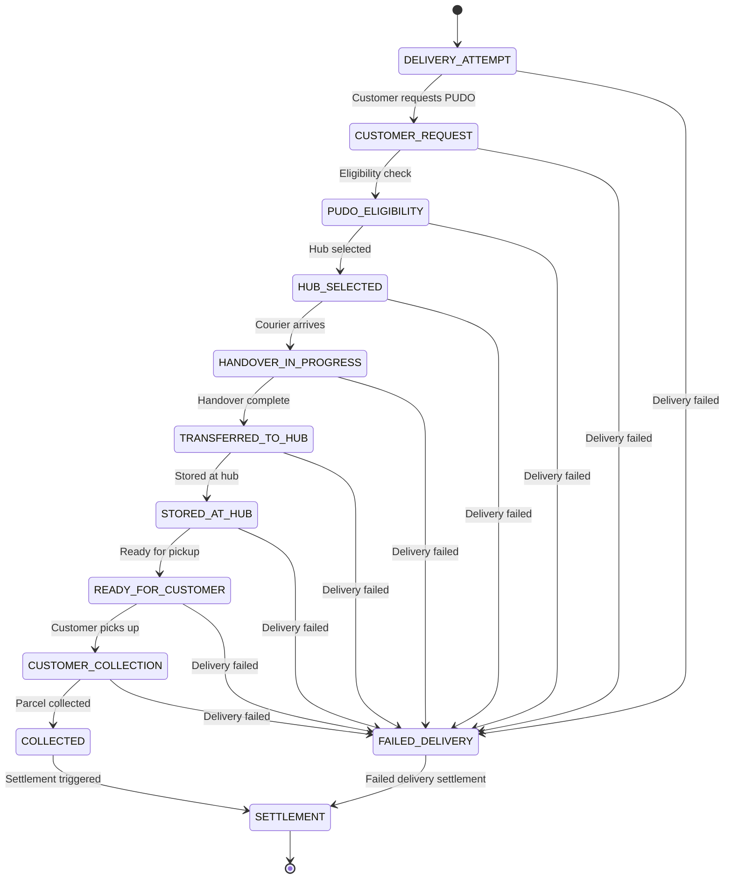
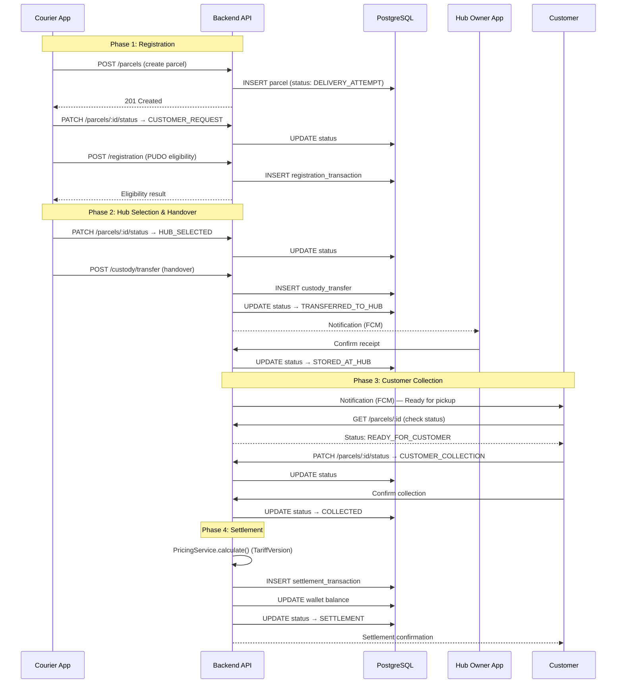
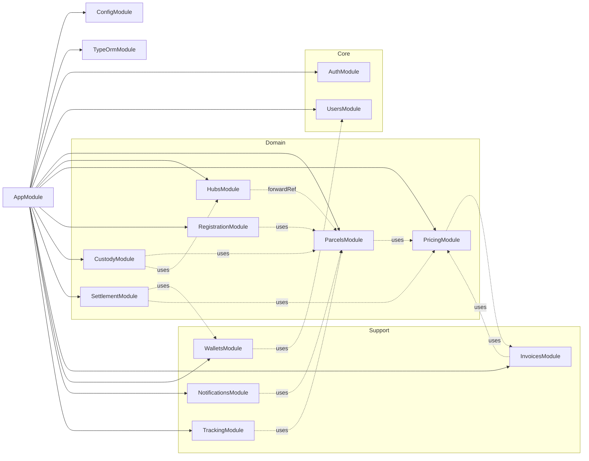
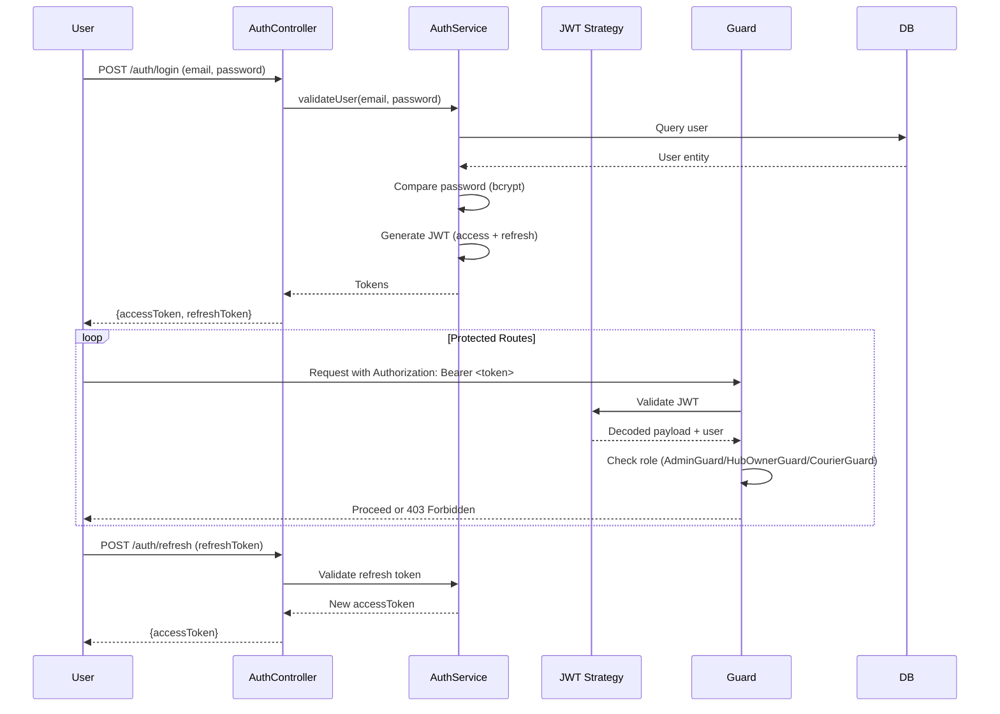
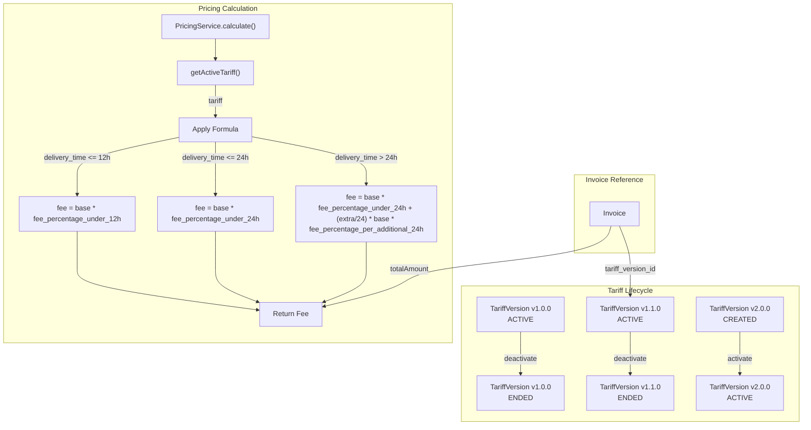
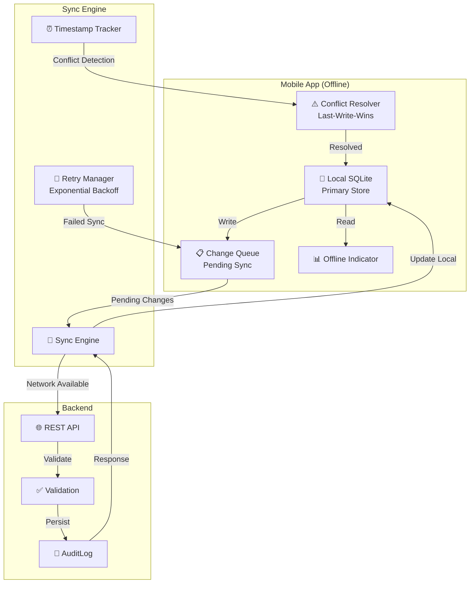
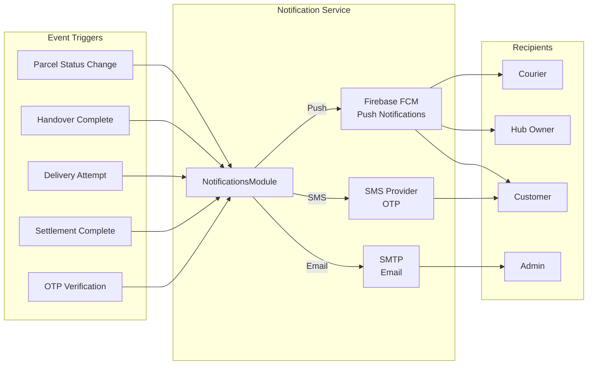
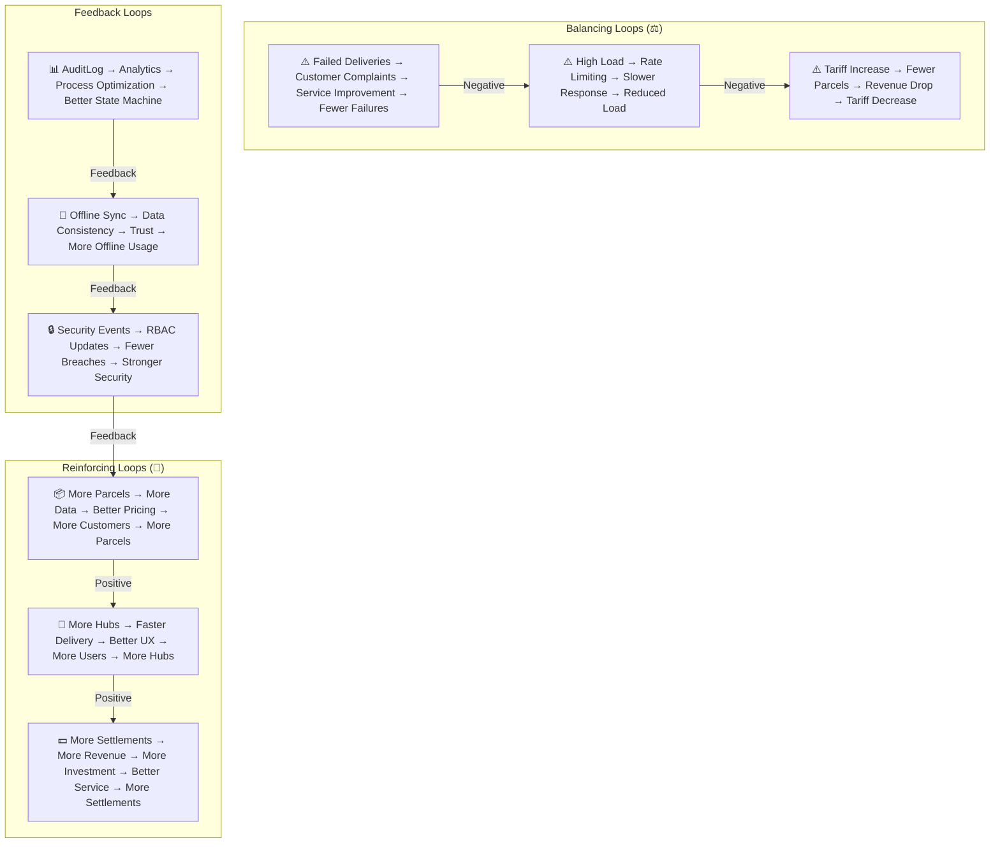
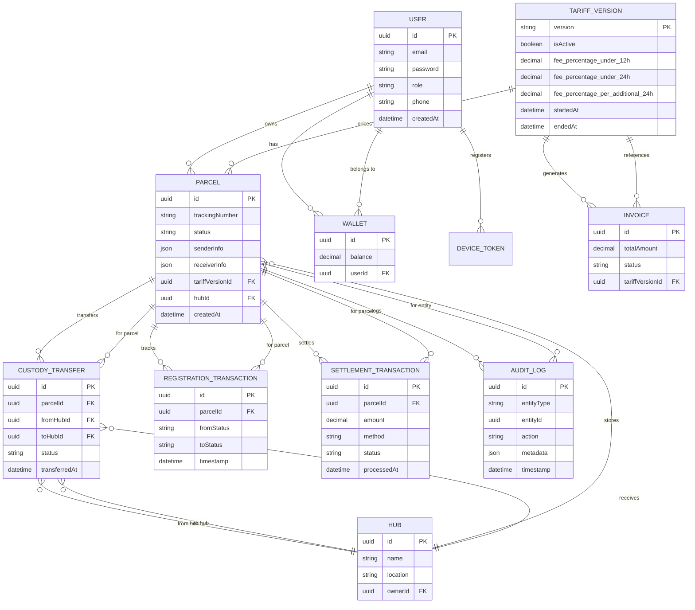
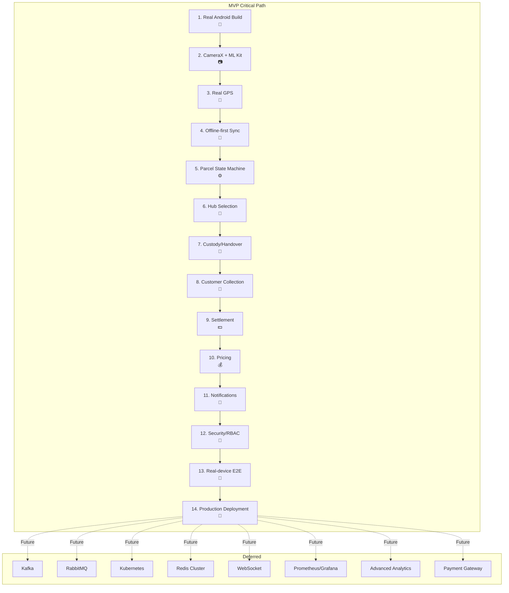

# N-PuDo-N System Thinking Map

> A visual representation of how all system components interrelate, flow, and depend on each other.

---

## 1. System Overview — Component Map

```mermaid
graph TB
    subgraph "📱 Mobile Apps"
        COURIER["📱 Courier App<br/>(Flutter)"]
        HUB["📱 Hub Owner App<br/>(Flutter)"]
        CUSTOMER["📱 Customer<br/>(Web/Mobile)"]
    end

    subgraph "🌐 Admin Panel"
        ADMIN["🖥️ Admin Panel<br/>(Next.js)"]
    end

    subgraph "⚙️ Backend API"
        AUTH["🔐 Auth Module<br/>JWT + RBAC"]
        PARCELS["📦 Parcels Module<br/>State Machine"]
        HUBS["🏢 Hubs Module<br/>Delivery"]
        PRICING["💰 Pricing Module<br/>Tariff Versioning"]
        INVOICES["🧾 Invoices Module"]
        WALLETS["👛 Wallets Module"]
        NOTIFICATIONS["🔔 Notifications Module<br/>Firebase FCM"]
        TRACKING["📍 Tracking Module"]
        REGISTRATION["📝 Registration Module"]
        CUSTODY["🤝 Custody Module"]
        SETTLEMENT["💵 Settlement Module"]
        USERS["👥 Users Module"]
    end

    subgraph "🗄️ Data Layer"
        POSTGRES[(🐘 PostgreSQL<br/>Production)]
        SQLITE[(🗃️ SQLite<br/>Development)]
        REDIS[(🔴 Redis<br/>Cache/Sessions")]
    end

    subgraph "🚀 Infrastructure"
        NGINX["🌐 Nginx<br/>SSL Termination"]
        DOCKER["🐳 Docker Compose"]
        CI_CD["🔄 CI/CD<br/>GitHub Actions"]
    end

    COURIER -->|REST API| AUTH
    HUB -->|REST API| AUTH
    CUSTOMER -->|REST API| AUTH
    ADMIN -->|REST API| AUTH

    AUTH --> PARCELS
    AUTH --> HUBS
    AUTH --> PRICING
    AUTH --> INVOICES
    AUTH --> WALLETS
    AUTH --> NOTIFICATIONS
    AUTH --> TRACKING
    AUTH --> REGISTRATION
    AUTH --> CUSTODY
    AUTH --> SETTLEMENT
    AUTH --> USERS

    PARCELS --> POSTGRES
    HUBS --> POSTGRES
    PRICING --> POSTGRES
    INVOICES --> POSTGRES
    WALLETS --> POSTGRES
    NOTIFICATIONS --> POSTGRES
    TRACKING --> POSTGRES
    REGISTRATION --> POSTGRES
    CUSTODY --> POSTGRES
    SETTLEMENT --> POSTGRES
    USERS --> POSTGRES

    PARCELS --> REDIS
    HUBS --> REDIS
    NOTIFICATIONS --> REDIS

    NGINX --> PARCELS
    NGINX --> HUBS
    NGINX --> PRICING
    NGINX --> INVOICES
    NGINX --> WALLETS
    NGINX --> NOTIFICATIONS
    NGINX --> TRACKING
    NGINX --> REGISTRATION
    NGINX --> CUSTODY
    NGINX --> SETTLEMENT
    NGINX --> USERS

    DOCKER --> NGINX
    DOCKER --> POSTGRES
    DOCKER --> REDIS
    DOCKER --> PARCELS

    CI_CD --> DOCKER
```

---

## 2. Parcel Lifecycle — State Machine Flow



---

## 3. Data Flow — End-to-End Parcel Journey



---

## 4. Module Dependency Graph



---

## 5. Security & Auth Flow



---

## 6. Tariff Versioning & Pricing Flow



---

## 7. Offline-First Sync Architecture



---

## 8. Deployment Architecture

```mermaid
graph TB
    subgraph "Internet"
        INTERNET["🌐 Internet"]
    end

    subgraph "Nginx (SSL Termination)"
        NGINX["🌐 Nginx<br/>Port 80/443"]
    end

    subgraph "Backend Services"
        B1["Backend<br/>Replica 1"]
        B2["Backend<br/>Replica 2"]
    end

    subgraph "Data Services"
        PG[(PostgreSQL<br/>Primary)]
        RD[(Redis<br/>Cache/Sessions")]
    end

    subgraph "Admin Panel"
        ADMIN["Admin Panel<br/>Next.js"]
    end

    INTERNET --> NGINX
    NGINX -->|Load Balance| B1
    NGINX -->|Load Balance| B2
    NGINX --> ADMIN
    B1 --> PG
    B2 --> PG
    B1 --> RD
    B2 --> RD
    ADMIN --> PG

    subgraph "CI/CD"
        GH["GitHub Actions"]
        GH -->|Lint & Test| GH_TEST
        GH -->|Build Docker| GH_BUILD
        GH -->|Deploy Staging| GH_STAGING
        GH -->|Deploy Production| GH_PROD
    end

    GH_PROD -->|docker-compose up| NGINX
```

---

## 9. Notification System Flow



---

## 10. System Thinking — Causal Loop Diagram



---

## 11. Entity Relationship Map



---

## 12. MVP Critical Path Map



---

*Generated from `ARCHITECTURE.md` — N-PuDo-N Master System Architecture v1.0*
